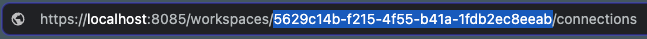

# Superside challenge resolution

[](<https://kubernetes.io/>) [](<https://www.terraform.io/>) <br>

[](https://airflow.apache.org/docs/apache-airflow/2.6.3/index.html) [](https://airflow.apache.org/docs/apache-airflow/2.6.3/index.html) [](https://www.python.org/downloads/release/python-31012/)  <br>

[](https://docs.astral.sh/ruff/) [](https://black.readthedocs.io/en/stable/) [](https://pycqa.github.io/isort/)<br>

[](https://conventionalcommits.org) [](https://pre-commit.com/)

Resolution of the Superside challenge for the Lead Data Engineer role.

## Directories structure

This is the structure of the project.

```text
.
├── .dockerignore
├── .env.dbt.local.example
├── .env.services.local.example
├── .github
│   └── workflows
│       └── pull-request.workflow.yaml
├── .gitignore
├── .markdownlint.json
├── .pre-commit-config.yaml
├── .python-version
├── .sqlfluffignore
├── .vscode
│   ├── extensions.json
│   └── settings.json
├── CONTRIBUTING.md
├── Dockerfile
├── LICENSE
├── Makefile
├── README.md
├── dags
│   ├── .airflowignore
│   ├── settings.py
│   └── transformations.py
├── dbt
│   └── superside
│       ├── .sqlfluff
│       ├── README.md
│       ├── analyses
│       │   └── .gitkeep
│       ├── dbt_project.yml
│       ├── logs
│       ├── macros
│       │   ├── .gitkeep
│       │   ├── generate_schema_name.sql
│       │   ├── intermediate
│       │   │   ├── extract_number.sql
│       │   │   └── map_categories.sql
│       │   └── macros.yml
│       ├── models
│       │   ├── intermediate
│       │   │   ├── _intermediate__models.yml
│       │   │   └── int_engagement_metrics.sql
│       │   ├── marts
│       │   │   ├── _marts__models.yml
│       │   │   ├── fct_engagement_metrics.sql
│       │   │   └── project_engagement.sql
│       │   └── staging
│       │       ├── _clients__models.yml
│       │       ├── _clients__sources.yml
│       │       └── stg_clients__engagement_metrics.sql
│       ├── packages.yml
│       ├── profiles.yml
│       ├── seeds
│       │   ├── .gitkeep
│       │   ├── marts
│       │   │   └── dim_project.csv
│       │   └── seeds.yml
│       ├── snapshots
│       │   └── .gitkeep
│       └── tests
│           └── .gitkeep
├── diagrams
│   ├── airbyte.png
│   ├── diagram.py
│   └── kubernetes.png
├── docker-compose.yml
├── images
│   └── cluster.png
├── infra
│   ├── .terraform.lock.hcl
│   ├── airbyte-values.yml
│   ├── airbyte.tf
│   ├── airflow-values.yml
│   ├── airflow.tf
│   ├── providers.tf
│   └── variables.tf
├── mypy.ini
├── noxfile.py
├── poetry.lock
├── pyproject.toml
├── registries.yaml
├── scripts
│   ├── clients_postgres_init.sh
│   └── warehouse_postgres_init.sh
└── source_data
    ├── dim_project.csv
    └── engagement_metrics_raw.csv

24 directories, 64 files
```

## What you'll need

This solution is runs in a local kubernetes cluster, so is containerized. You'll need the following mandatory tools in your local machine:

- [k3d](https://k3d.io/v5.6.0/#installation) for the local k8s cluster
- [kubectl](https://kubernetes.io/docs/tasks/tools/#kubectl) to manage the k8s cluster through the CLI
- [Docker and docker-compose](https://docs.docker.com/get-docker/)
  - Beware that you'll need around 10 GB of RAM available to allocate (check [this link](https://docs.docker.com/desktop/settings/#resources) to see how in Docker Desktop)
- [Terraform](https://developer.hashicorp.com/terraform/install?product_intent=terraform)
- [GNU Make](https://www.gnu.org/software/make/)
- [poetry](https://python-poetry.org/docs/#installing-with-the-official-installer) to handle python dependencies
  - There's an useful make rule for this one, so you can skip its installation

Depending on your OS your installation process will be different. If you're in macOS you can run:

```bash
brew install k3d docker docker-compose tfenv
tfenv install 1.5.6
tfenv use 1.5.6
```

There are other optional dependencies:

- [Lens](https://k8slens.dev/) to easily manage the k8s cluster
- [DBeaver](https://dbeaver.io/download/) as a desktop SQL client like
- The recommended VS Code extensions

## Architecture overview

The selected data stack is as follows:

- [Airbyte](https://airbyte.com/) for data movement
- [Airflow](https://airflow.apache.org/) for workflow orchestration
  - The Airflow cluster is deployed with the `CeleryExecutor` and a Redis database working as a message broker between Celery and the worker.
- [dbt](https://docs.getdbt.com/) for data modeling
  - The Airflow and dbt integration was made through [cosmos](https://astronomer.github.io/astronomer-cosmos/)
- [Postgres](https://www.postgresql.org/) for data storage
  - This DB was selected just for simplicity
- A local [registry](https://registry.hub.docker.com/_/registry/) for storing and distributing container images

Airbyte and Airflow are installed in the kubernetes cluster via helm through its terraform providers.

This is a simplified diagram of the architecture:

<p align="center">
  
</p>

### Container orchestration

Each platform runs in its own node and namespace. These nodes are labeled with the `component: [platform]` label, where `platform` can be either `airbyte` or `airflow`. Then, the `nodeSelector` property is set to `component: [platform]` in each platform's values files.

Both platforms will run its jobs in ephemeral pods, which will be scheduled in a third node with label `component: jobs`. This is convenient for these reasons:

- If using a node provisioner like [karpenter](https://karpenter.sh/), this architectue allows to provide ephemeral nodes just to run this workloads an then remove them, saving costs.
- As the pods runs in isolated environments, any kind of disruption won't affect the other platform's components.
- The nodes and its pods' resources, requests, and limits can be managed separately
- The ephemeral pods' resources can be modified through Airflow variables, as I've used the [kubernetesPodOperator](https://airflow.apache.org/docs/apache-airflow-providers-cncf-kubernetes/stable/operators.html#kubernetespodoperator) in the transformations DAG, making it easier to manage them

### Data flow

The data flow is as follows (the provided raw data is in the `source_data` directory):

1. The raw `engagement_metrics_raw.csv` data is loaded into the `clients` DB through the `scripts/clients_postgres_init.sh` script. This DB is considered as a source.
    - This was done to better emulate a production environment, and to allow me to use Airbyte, because otherwise I would need [these credentials](https://docs.airbyte.com/integrations/sources/google-sheets#prerequisites) which I don't have, in order to sync the data directly from the Google Sheets.
2. Once Airbyte runs its sync, the raw data is moved to the `warehouse` DB, which is the destination. You'll find the data in the `clients.engagement_metrics` landing table.
3. Then, Airflow triggers the dbt transformations, and the models are materialized in the `warehouse` DB, in separate schemas:
    - `staging`: materialized as a view, where simple casting and renaming is done, and has a 1-1 relation with the landing table.
    - `intermediate`: materialized as a view, where more complex transformations are done to normalize and prepare data for downstream consumption.
    - `marts`: materialized as a table, where the `dim_project.csv` data is loaded as a seed, and then joined with the `fct_engagement_metrics` table in a model named `engagement_metrics`.

## Setup

Before you begin, please disconnect any VPN you might be connected to, if any.

Please, take into account that the whole process will take at least 30 minutes, depending if you have previously pulled the Docker images, and your internet connectivity.

### 1. Generate the environment variables

Open a shell in your machine, and navigate to this directory. Then run:

```bash
make generate-dotenv
```

This will generate two `.env` files with predefined values. Please, go ahead and open it! If you want to modify some values, just take into account that this may break some things.

### 2. Install the project dependencies

Run these commands in this sequence (beware if you've `poetry` already installed in your machine):

```bash
make install-poetry
make install-project
make dbt-install-pkgs
```

Optionally, if you've cloned the repo, you can run:

```bash
make install-pre-commit
```

To install the pre-commit hooks and play around with them.

### 3. Create an empty k8s cluster in your machine

> :warning: Remember to assign the 10 GB of RAM in Docker Desktop.

Run these command and wait a while for the cluster to be ready:

```bash
make cluster-create
```

You can monitor its state with Lens. Anyway, you can check the pods status from the terminal:

```bash
watch -d kubectl get pods -A
```

Wait until they're in the `Running` state.

Also, this command creates some useful services which you can check that are running both with Docker Desktop or by running:

```bash
docker ps
```

### 4. Deploy the platforms

> Each time you run any command related to the cluster through a make rule, the current context is switched to the local cluster, to avoid any conflicts with other ones you may have in your `~/.kube/config` file.

To deploy Airbyte and Airflow in the cluster, run:

```bash
make cluster-install-apps
```

This will take a while (10-15 minutes, depending on your machine), but you can monitor the state the same way you did before.

### 5. Setup Airbyte

Go ahead and port-forward the following services to these local ports (verify that you aren't using them already):

- Airbyte web server: 8085
- Airbyte API server: 8001
- Airflow web server: 8090

You can do this manually with Lens, or by running:

```bash
make cluster-port-forward
```

Verify that you can access the web servers by going to [http://localhost:8085](http://localhost:8085) and [http://localhost:8090](http://localhost:8090).

Then, please complete the Airbyte's initial setup.

<p align="center">
  
</p>

Once done, please copy the workspace id from the Airbyte UI.

<p align="center">
  
<p>

Or by running:

```bash
curl -u airbyte:airbyte http://localhost:8001/api/public/v1/workspaces
```

Then, please fill the `workspace_id` in the `infra/variables.tf` file and run:

```bash
make cluster-setup-airbyte
```

This will trigger some Airbyte jobs that will run in some pods, so it will take a while to complete (around 5 minutes).

Once finished, go to the Airbyte's connections, and you'll see a new one named `Clients`. Please trigger a sync manually and wait until it finishes (around 5-10 minutes).

### 6. Run the dbt models with Airflow

As the dbt models will run in ephemeral pods via the [kubernetesPodOperator](https://airflow.apache.org/docs/apache-airflow-providers-cncf-kubernetes/stable/operators.html#kubernetespodoperator), you'll need to provide an image to the containers. To do this, please run:

```bash
make cluster-local-image
```

Go to [http://localhost:8090](http://localhost:8090), and login with the default credentials `airflow:airflow`.

Then, unpause the `transformations` DAG. You should see how the dbt models are running in the ephemeral pods (scheduled in the node with label `component=jobs`). Please check this with Lens, or by running:

```bash
watch -d kubectl get pods \
  -n airflow \
  --field-selector spec.nodeName=$(
      kubectl get nodes \
        -l component=jobs \
        -o jsonpath='{.items[0].metadata.name}'
    )
```

Then, wait around 2 minutes until the models run.

### 7. Check the results in the warehouse

Open your SQL client and connect to the warehouse. These are the credentials:

- User: `warehouse`
- Password: `warehouse`
- Database: `warehouse`
- Host: `localhost`
- Port: `5470`

The run:

```sql
SELECT * FROM marts.project_engagement;
```

Please go ahead and check the tables and views in the others schemas.

## Data exploration

Explanations here
